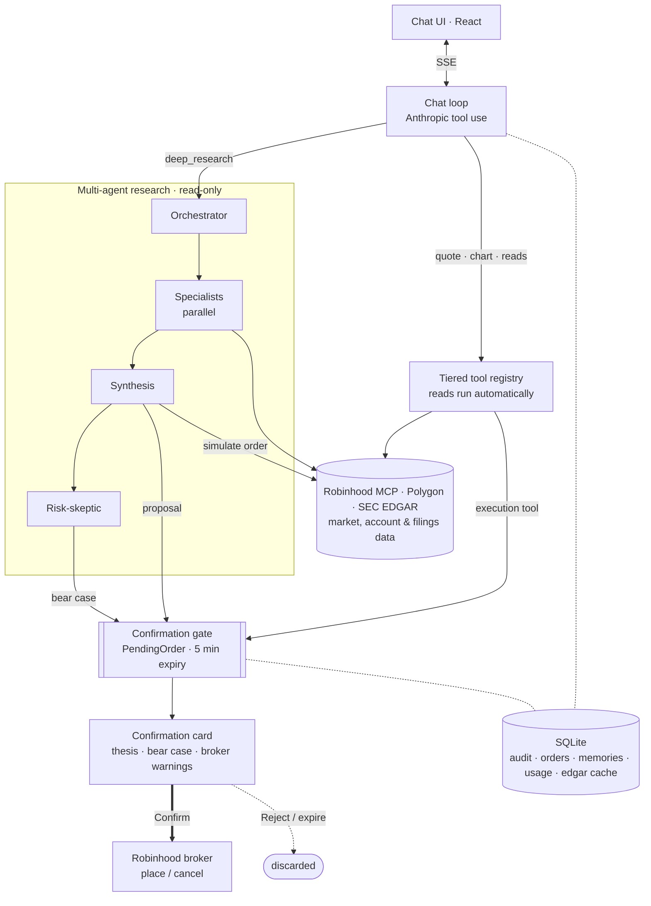
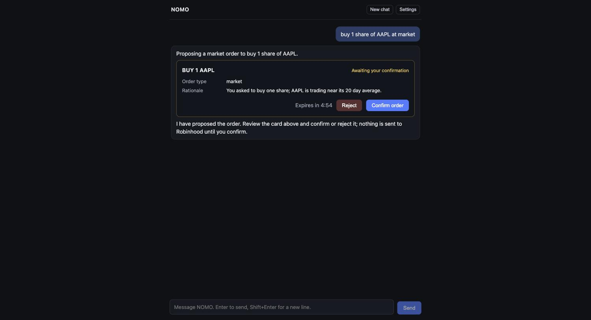

# NOMO

A self-hostable AI trading chat for Robinhood agentic accounts. You talk to Claude in a local chat interface; Claude can pull market data, render candlestick charts inline, read your Robinhood portfolio through the official Trading MCP, and propose trades. Every trade proposal stops at a mandatory confirmation card. Nothing reaches the broker until you click Confirm.


https://github.com/user-attachments/assets/52eb0f8c-7432-489f-aa26-9338a546d7fe


## Disclaimer, read this first

This app connects to a real brokerage account and can place real orders after your confirmation. You are responsible for every trade made through it. Before using it:

- Review Robinhood's agentic account controls, including spending limits and the kill switch, and set them to levels you are comfortable with.
- Understand that the AI can be wrong. It interprets and proposes; it does not know the future, and its rationale can be flawed.
- Keep the app on localhost. It has no authentication of its own and refuses to bind to non-loopback addresses for that reason.
- Nothing here is financial advice. The software is provided as is, under the MIT license, with no warranty.

## How it works



The one hard rule the diagram encodes: no path reaches the broker except a confirmed `PendingOrder` you approve on the card (the thick Confirm edge). Specialists, synthesis, and the skeptic hold read and simulation tools only.

The core principle: the LLM interprets and decides, deterministic code computes and executes.

- Claude never generates price data. Charts and indicators (SMA, EMA, VWAP) are fetched from Polygon and computed in TypeScript; Claude only chooses what to request.
- Company financials, recent filings, and insider trades come from SEC EDGAR (free, keyless, cached locally in SQLite). Growth rates, margins, and leverage ratios are computed deterministically in TypeScript from the source XBRL; the model never derives them from a filing.
- Simple rules (SMA crossover, price vs SMA, RSI reversion, buy and hold) can be backtested against a ticker's daily history with `backtest_strategy`. The model picks the rule and parameters; the return, win rate, and drawdown are simulated deterministically in TypeScript, long-only and with no lookahead.
- Recent news headlines come from Polygon (free tier, the same key) via `get_news`, with the source's own sentiment when available. The model reads and interprets the headlines; it never invents them.
- Claude never has a direct path to order execution. Every tool is registered in a tiered registry:

| Tier | Examples | Behavior |
|------|----------|----------|
| `market_data` | get_quote, get_ohlcv, render_chart, deep_research | Runs automatically |
| `portfolio_read` | positions, balances, P/L, fundamentals, watchlists | Runs automatically |
| `account_write` | edit watchlists, edit scanners | Runs automatically (reversible, moves no money); toggle off in settings |
| `execution` | place_equity_order, cancel_equity_order | Never runs directly. Confirmation gate required |

- An execution tool call only creates a pending order (a placement or a cancellation) with a 5 minute expiry. The UI renders a confirmation card; Confirm forwards the exact stored parameters to Robinhood, Reject discards them. The only code path that can reach a Robinhood execution tool requires a stored order in confirmed status. There is no bypass flag.
- If the linked Robinhood MCP exposes an order review tool, placements are previewed with it before being sent, and a review failure aborts the placement.
- For a trade idea or a should-I-buy question, Claude calls `deep_research`, which runs a fan-out of read-only specialist agents into a synthesis and a risk-skeptic step, and can propose one order that still stops at the same gate. See [Multi-agent research](#multi-agent-research) below. Simple requests like a quote or chart skip it.
- Disabling a tool tier in settings removes those tools from the schema sent to Claude, not just from what can run.
- Every tool call is written to a local audit log with tier, parameters, and outcome.
- Conversations are saved to the local database, so a reload restores the transcript and past chats are listed in a collapsible sidebar. Assistant replies render Markdown.
- While Claude works, a live activity indicator shows each tool call as it runs and collapses to a compact "Used N tools" summary once the answer lands.
- The header shows an estimated running total of Anthropic API spend for this instance, priced from list rates and recorded locally.



## Multi-agent research

For a trade idea or a should-I-buy-or-sell question, Claude can run a `deep_research` pass instead of gathering everything itself. An orchestrator plans which specialists the request needs and fans them out in parallel, each a narrow sub-agent that can only see its own cluster of read tools and must return typed findings, never prose:

- **Screener** for idea generation, **Technicals** for price structure, **Fundamentals & earnings** for valuation and the earnings setup, **Filings & events** for recent SEC filings and insider activity, **News** for recent headlines and catalysts, **Portfolio & risk** for exposure and tax lots, and an **Options** specialist that is off by default.
- A **Synthesis** step merges the findings into one thesis and at most one concrete proposal. A **Risk-skeptic** then argues the bear case against it.
- Before any proposal becomes a pending order, it is simulated with Robinhood's order review tool, and the broker's pre-trade warnings are captured. If the simulation fails, no proposal is created.

The confirmation card for a researched proposal shows the thesis, the bear case, and the broker's pre-trade warnings side by side, so you confirm with the full picture. The live activity indicator shows each specialist as its own lane while they run.

The core rule holds throughout: no specialist, and neither the synthesis nor the skeptic step, ever holds an order tool. Research shapes proposals only. The single path to the broker is still a confirmed pending order, and simple requests like a quote or a chart skip the orchestrator and hit the tools directly. Specialists run on a cheaper model and synthesis on the stronger one, so a full pass stays inexpensive; the header cost estimate includes every sub-agent.

## Learning loop

The agent can learn from your history so its proposals get more tailored over time. This never touches execution: no stored fact, lesson, or track record can auto-confirm, resize, or skip the confirmation gate. Learning shapes what Claude proposes, never whether or how a trade is placed.

- **Trader profile memory.** Claude can record durable facts about you as a trader (risk tolerance, position sizing, watched tickers, strategy preferences) with the `remember` tool. Relevant memories are injected into each session as read-only background context, never as instructions, within a small token budget.
- **Veto feedback.** The confirmation card's Reject action takes an optional one-line reason. On demand, `distill_lessons` reviews your confirm and reject history and proposes durable patterns (for example, a size threshold you consistently reject above).
- **Trade journal.** Confirmed trades keep their rationale. `record_outcome` logs realized P/L when a position closes, and `review_performance` computes Claude's own proposal track record by strategy or setup so later proposals can reflect what actually worked.
- **Conversation search.** Past chats are indexed locally with SQLite FTS5 and searchable through the `search_history` tool.

Everything the agent learns is visible and yours to manage. Distilled lessons land in a review list in Settings as pending candidates; nothing about you is stored invisibly, and you can approve, edit, deactivate, or delete any memory there.

## What you need

- Node.js 20 or newer
- An [Anthropic API key](https://console.anthropic.com/)
- A free [Polygon.io](https://polygon.io/) API key (the free tier is enough; the app caches aggressively to stay under its limits)
- A Robinhood account with agentic trading enabled (optional until you want portfolio access and trading)

## Setup from a fresh clone

```sh
git clone <this repo>
cd NOMO
npm install
npm run dev
```

Open http://localhost:5173. On first run the app creates a local SQLite database and shows a setup screen:

1. Enter your Anthropic API key and Polygon API key. Both are validated with a test call before being stored. They are saved in `server/data/app.db` on your machine and sent nowhere except to the respective provider.
2. You can chat and render charts immediately after that.

To connect Robinhood:

1. In the Robinhood app or website, set up agentic trading: Robinhood isolates it in a separate agentic account that starts unfunded. Move in only what you intend to trade with, and review the spending limits and kill switch. See [Robinhood's agentic trading overview](https://robinhood.com/us/en/support/articles/agentic-trading-overview/).
2. In NOMO, open Settings and click Link Robinhood. A Robinhood authorization page opens; approve access there.
3. Back in NOMO, settings shows the connected read only tools (accounts, portfolio, positions, orders, quotes, search). Only read tools are mapped automatically; trading goes through the confirmation gate.

Environment configuration is optional. Copy `.env.example` to `.env` to change the port or model. API keys never live in `.env`.

## Development

```sh
npm run dev          # backend on :3001 and frontend on :5173
npm run typecheck    # all workspaces
npm test             # server unit and integration tests
```

Tests live in `server/tests/` (mirroring `server/src/`) and run against a mock Robinhood MCP server (`server/tests/mocks/mockRobinhoodMcp.ts`); they never touch the real broker. The gate lifecycle (propose, confirm, reject, expire) is covered by integration tests, and the mock records exactly what would have reached the broker so the tests can assert the confirmation gate forwards only stored parameters.

A pre-commit hook and a CI job both fail if a `.env` file or a database file is ever committed.

## Repository layout

```
frontend/   React chat UI, charts, confirmation cards, settings
server/     Express backend, chat loop, tool registry, gate, SQLite
shared/     Types shared by both
docs/       Screenshots and assets
```

## License

MIT. See [LICENSE](LICENSE).
